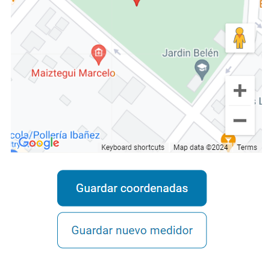

# SN | Medidores de agua


## Descripción

Esta aplicación está destinada a los operarios encargados de tomar las mediciones de los medidores de agua. Los operarios pueden agregar nuevos medidores, actualizando las coordenadas de latitud y longitud donde se encuentren situados con su celular, así como actualizar las coordenadas de medidores ya instalados. Además, permite registrar las mediciones mensuales de los medidores. 
También está destinada para que un usuario administrador pueda ver todos los medidores y todas las mediciones en tablas separadas, con la capacidad de filtrarlas y modificar sus datos según sea necesario.

## Pantallas

__Coordenadas__:

En la pantalla principal "Coordenadas," el usuario puede buscar un medidor filtrándolo por calle, número, barrio y número de medidor para actualizar sus coordenadas. 


El usuario puede ver su ubicación actual en un mapa junto con la información de latitud y longitud. Al guardar un nuevo medidor, se almacenarán las coordenadas de latitud y longitud correspondientes a la ubicación actual del operario con su celular.
<br><br>

<br><br>
**Botones:**



## Instrucciones de Instalación

### Instalación de Dependencias del Cliente

1. Accede al directorio del cliente con el siguiente comando:
    ```
    cd client
    ```

2. Ejecuta el siguiente comando para instalar las dependencias necesarias:
    ```
    npm install
    ```

Este comando descargará e instalará todas las bibliotecas y paquetes requeridos para el cliente.

### Instalación de Dependencias del Servidor

1. Abre otra terminal o regresa al directorio principal del proyecto mediante el comando `cd ...`.

2. Accede al directorio del servidor con el comando:
    ```
    cd server
    ```

3. Ejecuta el siguiente comando para instalar las dependencias del servidor:
    ```
    npm install
    ```

Esto garantizará que todas las bibliotecas esenciales para la parte del servidor estén instaladas.


## Configuración de Variables de Entorno

### Variable de Entorno del Puerto
- **PORT**: Esta variable de entorno especifica el puerto en el que el servidor escuchará las solicitudes de entrada.

### Variables de Entorno de la Base de Datos
- **DEVELOPMENT_USERNAME**: Usuario para acceder a la base de datos en el entorno de desarrollo.
- **DEVELOPMENT_PASSWORD**: Contraseña asociada al usuario de la base de datos en el entorno de desarrollo.
- **DEVELOPMENT_DATABASE**: Nombre de la base de datos en el entorno de desarrollo.
- **DEVELOPMENT_HOST**: Dirección del host de la base de datos en el entorno de desarrollo.
- **DEVELOPMENT_DIALECT**: Dialecto de la base de datos en el entorno de desarrollo.

### Variables de Entorno de la Conexión FTP
- **FTP_HOST**: Dirección IP del servidor FTP.
- **FTP_USER**: Nombre de usuario para la conexión FTP.
- **FTP_PASSWORD**: Contraseña para la conexión FTP.

## Uso del Proyecto

Para utilizar este proyecto, sigue los siguientes pasos:

### Servidor del Cliente

1. Abre una terminal en Visual Studio Code y navega hasta el directorio del cliente utilizando el siguiente comando:
    ```sh
    cd client
    ```

2. El proyecto en el frontend fue creado con Vite + React, por lo tanto, para iniciar el servidor del cliente, ejecuta:
    ```sh
    npm run dev
    ```

Este comando iniciará el servidor del cliente y estará listo para mostrar la interfaz de usuario en el navegador.

### Servidor del Backend

1. Abre una segunda terminal en Visual Studio Code y navega hasta el directorio del servidor utilizando el siguiente comando:
    ```sh
    cd server
    ```

2. Inicia el servidor del backend de una de las siguientes formas:

   - Ejecuta el siguiente comando para iniciar el servidor con nodemon, que proporciona reinicio automático durante el desarrollo:
     ```sh
     npm run dev
     ```

   - O utiliza el script `start` del archivo `package.json` para iniciar el servidor:
     ```sh
     npm start
     ```

   - Alternativamente, puedes iniciar el servidor manualmente ejecutando el siguiente comando:
     ```sh
     node src/app.js
     ```

   Cualquiera de estas formas iniciará el servidor del backend y estará listo para manejar las solicitudes del cliente.


Esto iniciará el servidor del backend y estará listo para manejar las solicitudes del cliente.

### Acceso a la Ruta del Administrador

Para acceder a la ruta del administrador en este proyecto, utiliza las siguientes credenciales:

- **Email:** admin_snciudad@gmail.com
- **Contraseña:** adminCiudadSn14

Estas credenciales te permitirán iniciar sesión como administrador y acceder a la tabla de tramites registrados en la base de datos.

# Endpoints

## Endpoints de Usuarios

### `GET /api/usuarios`

Este endpoint está diseñado para permitir a los desarrolladores obtener una lista de todos los usuarios registrados en la aplicación. Es importante destacar que este endpoint no está implementado en el proyecto en sí, sino que está destinado a ser utilizado por los desarrolladores para acceder a la información de los usuarios registrados.

Para visualizar la información de los usuarios, los desarrolladores pueden utilizar herramientas como Postman, Thunder Client, o simplemente acceder al endpoint desde un navegador web.

### `POST /api/iniciarsesion`

Al enviar una solicitud a este endpoint con las credenciales de un usuario, se autentica al usuario y se inicia sesión en la aplicación.

### `POST /api/registro`

Este endpoint permite a los usuarios registrarse en la aplicación proporcionando la información necesaria. Antes de completar el registro, se valida que el email no se haya registrado antes.

## Endpoints de Trámites

### `POST /api/nuevotramite`

Al enviar una solicitud a este endpoint con la información del nuevo trámite, se crea un nuevo registro de trámite en la base de datos.

### `GET /api/tramites`

Este endpoint permite obtener una lista de todos los trámites de solicitud de carnet de manipulador de alimentos realizados por los usuarios.

### `GET /api/verificarusuariotramite/:userId`

Al enviar una solicitud a este endpoint con el ID de usuario, se verifica si el usuario tiene un trámite de solicitud de carnet de manipulador de alimentos en curso.

### `PUT /api/gestionartramite/:id/:accion`

Este endpoint permite a los usuarios autorizados gestionar sus trámites de solicitud, realizando acciones como aprobar, rechazar o cancelar un trámite específico mediante la especificación del ID del trámite y la acción correspondiente.

Estos endpoints proporcionan una interfaz fácil de usar para que los vecinos de San Nicolás puedan completar el trámite de solicitud de carnet de manipulador de alimentos de manera eficiente y efectiva.


## Tecnologías y Herramientas Usadas

Este proyecto ha sido desarrollado utilizando las siguientes tecnologías:

- **React + Vite**

- **Tailwind**

- **Node.js**

- **Express**

- **MySQL**
